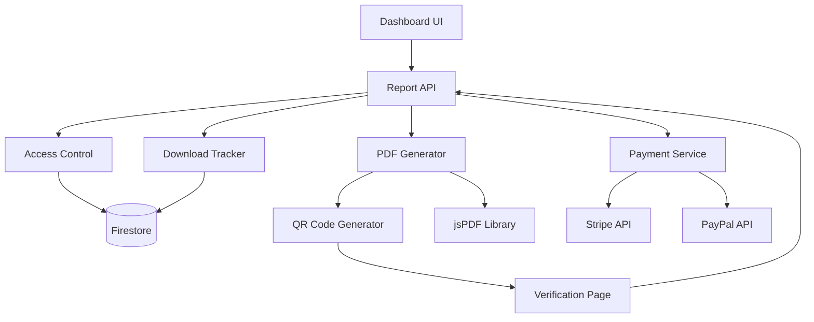

# Design Document: Petition Report PDF Generation

## Overview

The Petition Report PDF Generation feature enables petition creators to generate professional, verifiable PDF reports of their petitions. The feature implements tier-based access control, download tracking, payment integration for additional downloads beyond free allocation, and QR code verification to prevent forgery.

The system is designed to work seamlessly during beta launch (unlimited free access) and transition smoothly to the production model (tier-based with payment for additional downloads). The architecture separates concerns between PDF generation, access control, payment processing, and verification.

## Architecture

### High-Level Architecture



### Component Layers

1. **Presentation Layer**: Dashboard UI, Payment Modal, Verification Page
2. **API Layer**: Report generation, purchase, download, and verification endpoints
3. **Business Logic Layer**: Access control, download tracking, payment processing
4. **Generation Layer**: PDF creation, QR code generation
5. **Data Layer**: Firestore persistence for download history and tracking

### Data Flow

**Free Download Flow:**

```
User clicks button → Check tier & beta mode → Check download count →
Generate PDF → Update tracking → Return PDF
```

**Paid Download Flow:**

```
User clicks button → Check tier & beta mode → Check download count →
Show payment modal → Process payment → Generate PDF → Update tracking →
Send confirmation email → Return PDF
```

**Verification Flow:**

```
User scans QR code → Redirect to verification page → Fetch petition data →
Display verification information
```

## Components and Interfaces

### 1. Report API Endpoints

#### Generate Report Endpoint

```typescript
POST / api / petitions / [id] / report / generate;

interface GenerateReportRequest {
  petitionId: string;
}

interface GenerateReportResponse {
  success: boolean;
  downloadUrl?: string;
  requiresPayment?: boolean;
  downloadCount: number;
  freeDownloadsRemaining: number;
  message: string;
}
```

#### Purchase Report Endpoint

```typescript
POST / api / petitions / [id] / report / purchase;

interface PurchaseReportRequest {
  petitionId: string;
  paymentMethod: 'stripe' | 'paypal';
}

interface PurchaseReportResponse {
  success: boolean;
  paymentIntentId?: string; // For Stripe
  orderId?: string; // For PayPal
  amount: 19; // MAD
}
```

#### Download Report Endpoint

```typescript
GET /api/petitions/[id]/report/download?paymentId={id}

Response: PDF file (application/pdf)
Filename: petition-report-{referenceCode}-{date}.pdf
```

#### Verify Report Endpoint

```typescript
GET / api / reports / verify / [petitionId];

interface VerifyReportResponse {
  valid: boolean;
  petition: {
    title: string;
    referenceCode: string;
    createdAt: Date;
    currentSignatures: number;
  };
  reportInfo: {
    totalDownloads: number;
    lastDownloaded: Date;
  };
}
```

### 2. Access Control Service

```typescript
interface AccessControlService {
  /**
   * Determines if a user can generate a report for a petition
   */
  canGenerateReport(petition: Petition, userId: string): AccessDecision;

  /**
   * Determines if payment is required for the next download
   */
  requiresPayment(petition: Petition): boolean;

  /**
   * Calculates remaining free downloads
   */
  getRemainingFreeDownloads(petition: Petition): number;

  /**
   * Checks if beta mode is active
   */
  isBetaMode(): boolean;
}

interface AccessDecision {
  allowed: boolean;
  reason?: string;
  requiresUpgrade?: boolean;
}
```

**Access Control Logic:**

- If beta mode is active: Allow all tiers, unlimited downloads
- If beta mode is inactive:
  - Free tier: Deny access, show upgrade prompt
  - Paid tiers: Allow access
    - Downloads 1-2: Free
    - Downloads 3+: Require payment (19 MAD)

### 3. PDF Generator Service

```typescript
interface PDFGeneratorService {
  /**
   * Generates a complete PDF report for a petition
   */
  generateReport(petition: Petition, downloadNumber: number): Promise<Buffer>;

  /**
   * Generates a QR code for verification
   */
  generateQRCode(petitionId: string): Promise<string>;

  /**
   * Creates the cover page
   */
  createCoverPage(doc: jsPDF, petition: Petition, qrCode: string): void;

  /**
   * Creates the details page
   */
  createDetailsPage(doc: jsPDF, petition: Petition): void;

  /**
   * Creates the content page
   */
  createContentPage(doc: jsPDF, petition: Petition): void;

  /**
   * Creates the statistics page
   */
  createStatisticsPage(doc: jsPDF, petition: Petition): void;

  /**
   * Creates the verification page
   */
  createVerificationPage(
    doc: jsPDF,
    petition: Petition,
    downloadNumber: number,
  ): void;
}
```

**PDF Structure:**

- Page 1: Cover (logo, title, reference code, QR code, generation date)
- Page 2: Details (type, category, addressee, publisher, tier info)
- Page 3: Content (full description)
- Page 4: Statistics (signatures, comments, views, shares, timeline)
- Page 5: Verification (generation info, platform details, legal notice)

**Technical Requirements:**

- Library: jsPDF
- Font: Cairo (for Arabic support)
- Layout: RTL for Arabic text
- QR Code: Generated using qrcode library
- File naming: `petition-report-{referenceCode}-{YYYY-MM-DD}.pdf`

### 4. Download Tracker Service

```typescript
interface DownloadTrackerService {
  /**
   * Records a download and updates tracking data
   */
  recordDownload(
    petitionId: string,
    userId: string,
    paymentId?: string,
    ipAddress?: string,
  ): Promise<void>;

  /**
   * Gets download history for a petition
   */
  getDownloadHistory(petitionId: string): Promise<DownloadRecord[]>;

  /**
   * Gets current download count
   */
  getDownloadCount(petitionId: string): Promise<number>;
}

interface DownloadRecord {
  downloadedAt: Date;
  downloadedBy: string;
  downloadNumber: number;
  paymentId?: string;
  ipAddress?: string;
}
```

### 5. Payment Service

```typescript
interface PaymentService {
  /**
   * Creates a Stripe payment intent for report download
   */
  createStripePayment(
    petitionId: string,
    userId: string,
  ): Promise<StripePaymentIntent>;

  /**
   * Creates a PayPal order for report download
   */
  createPayPalOrder(petitionId: string, userId: string): Promise<PayPalOrder>;

  /**
   * Verifies payment completion
   */
  verifyPayment(
    paymentId: string,
    method: 'stripe' | 'paypal',
  ): Promise<boolean>;

  /**
   * Sends payment confirmation email
   */
  sendConfirmationEmail(
    userId: string,
    petitionId: string,
    paymentId: string,
  ): Promise<void>;
}
```

**Payment Configuration:**

- Amount: 19 MAD (fixed price)
- Methods: Stripe, PayPal
- Currency: MAD (Moroccan Dirham)
- Description: "Petition Report Download - {petition title}"

### 6. UI Components

#### Report Download Button

```typescript
interface ReportButtonProps {
  petition: Petition;
  onDownload: () => void;
  onUpgrade: () => void;
}

// Button states:
// 1. Free tier (post-beta): Disabled with lock icon
// 2. Free downloads available: "Free" badge with count
// 3. Payment required: "19 MAD" badge
// 4. Beta mode: "Free - Beta" badge
```

#### Payment Modal

```typescript
interface PaymentModalProps {
  petition: Petition;
  onPaymentComplete: (paymentId: string) => void;
  onCancel: () => void;
}

// Displays:
// - Price: 19 MAD
// - Features: Official PDF, QR verification, all statistics
// - Payment options: Stripe, PayPal
```

#### Verification Page

```typescript
interface VerificationPageProps {
  petitionId: string;
}

// Displays:
// - Petition title, reference code
// - Current statistics (signatures, comments, views)
// - Download count and last download date
// - Link to view full petition
```

## Data Models

### Petition Schema Extensions

```typescript
interface Petition {
  // ... existing fields

  // Report tracking
  reportDownloads: number;
  reportDownloadHistory: DownloadRecord[];

  // Optional: Share tracking (for future enhancement)
  shareStats?: {
    facebook: number;
    instagram: number;
    whatsapp: number;
    directLink: number;
    qrCode: number;
    lastUpdated: Date;
  };
}

interface DownloadRecord {
  downloadedAt: Date;
  downloadedBy: string; // userId
  downloadNumber: number; // 1st, 2nd, 3rd, etc.
  paymentId?: string; // If paid download
  ipAddress?: string;
}
```

### Feature Flag

```typescript
interface FeatureFlags {
  // ... existing flags

  betaMode: boolean; // Controls unlimited free access during beta
}
```

## Correctness Properties

_A property is a characteristic or behavior that should hold true across all valid executions of a system—essentially, a formal statement about what the system should do. Properties serve as the bridge between human-readable specifications and machine-verifiable correctness guarantees._

### Property 1: Report Content Completeness

_For any_ petition, when a report is generated, the PDF should contain all five required sections: cover page with QR code and reference code, details page with petition metadata, content page with full description, statistics page with all metrics, and verification page with generation information.

**Validates: Requirements 1.1, 1.2, 1.4, 1.5, 1.6, 1.7, 7.1, 7.2, 7.3, 7.4, 7.5**

### Property 2: Tier-Based Access Control

_For any_ petition and beta mode state, the access decision should follow these rules: if beta mode is active, all tiers can generate reports; if beta mode is inactive and tier is Free, access is denied; if beta mode is inactive and tier is paid, access is allowed.

**Validates: Requirements 2.1, 2.3, 2.4**

### Property 3: Download Count Increment

_For any_ petition, when a report is downloaded, the download count should increase by exactly 1 and the download history should contain a new record with all required fields (timestamp, user ID, download number, and optionally payment ID and IP address).

**Validates: Requirements 3.1, 3.2, 3.3, 3.5**

### Property 4: Download Information Display

_For any_ petition, when displaying download information, the system should show the current download count and correctly calculate remaining free downloads as max(0, 2 - downloadCount) for paid tiers.

**Validates: Requirements 3.4, 4.5**

### Property 5: Free Download Allocation

_For any_ petition with a paid tier in non-beta mode, the first 2 downloads should not require payment, and downloads beyond the 2nd should require payment.

**Validates: Requirements 4.1, 4.2, 4.3**

### Property 6: Payment Amount Consistency

_For any_ paid download request, whether using Stripe or PayPal, the payment amount should always be exactly 19 MAD.

**Validates: Requirements 5.1, 5.2, 5.3**

### Property 7: Payment Success Flow

_For any_ successful payment, the system should generate the report, update download tracking, and send a confirmation email.

**Validates: Requirements 5.4, 5.6**

### Property 8: Payment Failure Handling

_For any_ failed payment, the system should not generate a report and should display an error message.

**Validates: Requirements 5.5**

### Property 9: QR Code Verification URL

_For any_ generated report, the QR code should encode a URL in the format `https://3arida.ma/reports/verify/{petitionId}` where petitionId matches the petition's ID.

**Validates: Requirements 1.2, 6.1, 6.5**

### Property 10: Verification Page Content

_For any_ valid petition ID, the verification page should display the petition title, reference code, current statistics, total download count, and last download date.

**Validates: Requirements 6.2, 6.3**

### Property 11: Button State Calculation

_For any_ petition, the download button state should be determined by: if beta mode is active, show "Free - Beta"; if tier is Free and beta is inactive, show disabled with lock; if paid tier with remaining free downloads, show "Free" with count; if paid tier without free downloads, show "19 MAD".

**Validates: Requirements 8.2, 8.3, 8.4, 8.5**

### Property 12: Button Click Behavior

_For any_ petition, clicking the download button should: show upgrade modal if Free tier post-beta, generate immediately if free downloads available, or show payment modal if payment required.

**Validates: Requirements 8.6, 8.7, 8.8**

### Property 13: Atomic Download Tracking

_For any_ download operation, both the reportDownloads count and reportDownloadHistory array should be updated atomically (both succeed or both fail).

**Validates: Requirements 9.3**

### Property 14: Download History Record Structure

_For any_ download record in the history, it should contain downloadedAt, downloadedBy, downloadNumber, and optionally paymentId and ipAddress fields.

**Validates: Requirements 9.4**

### Property 15: Data Persistence

_For any_ download, if the download is recorded and then the petition is re-fetched from the database, the download data should still be present.

**Validates: Requirements 9.5**

### Property 16: PDF Filename Format

_For any_ generated report, the filename should match the pattern `petition-report-{referenceCode}-{YYYY-MM-DD}.pdf` where referenceCode is the petition's reference code and the date is the generation date.

**Validates: Requirements 10.6**

### Property 17: Error Handling for Missing Data

_For any_ report generation request with incomplete petition data, the system should return an error message indicating which data is missing.

**Validates: Requirements 11.1**

### Property 18: Payment Error Handling

_For any_ payment processing failure, the system should display an error message containing the failure reason.

**Validates: Requirements 11.2**

### Property 19: Network Error Recovery

_For any_ network error during generation, the system should display a retry option.

**Validates: Requirements 11.3**

### Property 20: Authorization Error Handling

_For any_ report generation request by a user who does not own the petition, the system should return an authorization error.

**Validates: Requirements 11.5**

### Property 21: Language Selection

_For any_ user with a selected language preference, all report-related UI elements (button, payment modal, verification page) should display text in that language.

**Validates: Requirements 12.4, 12.5, 12.6**

### Property 22: Beta Mode Unlimited Downloads

_For any_ petition while beta mode is active, unlimited downloads should be allowed without payment regardless of download count.

**Validates: Requirements 2.2**

## Error Handling

### Error Categories

1. **Access Errors**
   - Free tier attempting to generate report (post-beta)
   - User not authorized to generate report for petition
   - Petition not found

2. **Generation Errors**
   - Missing required petition data
   - PDF generation library failure
   - QR code generation failure

3. **Payment Errors**
   - Payment processing failure (Stripe/PayPal)
   - Payment verification failure
   - Network timeout during payment

4. **Data Errors**
   - Database write failure
   - Atomic update failure
   - Data persistence failure

### Error Response Format

```typescript
interface ErrorResponse {
  success: false;
  error: {
    code: string;
    message: string;
    details?: any;
  };
}
```

### Error Codes

- `ACCESS_DENIED`: User cannot access report feature
- `UPGRADE_REQUIRED`: Free tier needs to upgrade
- `PAYMENT_REQUIRED`: Payment needed for download
- `PAYMENT_FAILED`: Payment processing failed
- `GENERATION_FAILED`: PDF generation failed
- `NOT_FOUND`: Petition not found
- `UNAUTHORIZED`: User not authorized
- `MISSING_DATA`: Required data missing
- `NETWORK_ERROR`: Network failure
- `DATABASE_ERROR`: Database operation failed

### Retry Strategy

- **Network errors**: Automatic retry with exponential backoff (3 attempts)
- **Payment errors**: User-initiated retry
- **Generation errors**: User-initiated retry
- **Access errors**: No retry (require user action)

## Testing Strategy

### Dual Testing Approach

The testing strategy combines unit tests for specific examples and edge cases with property-based tests for universal correctness properties. Both approaches are complementary and necessary for comprehensive coverage.

**Unit Tests** focus on:

- Specific examples demonstrating correct behavior
- Edge cases (invalid petition IDs, missing data, network failures)
- Integration points between components
- Error conditions and error messages

**Property-Based Tests** focus on:

- Universal properties that hold for all inputs
- Comprehensive input coverage through randomization
- Invariants that must be maintained
- Business rules that apply across all scenarios

### Property-Based Testing Configuration

**Library**: fast-check (for TypeScript/JavaScript)

**Configuration**:

- Minimum 100 iterations per property test
- Each test tagged with feature name and property number
- Tag format: `Feature: petition-report-pdf, Property {N}: {property description}`

**Example Test Structure**:

```typescript
// Feature: petition-report-pdf, Property 1: Report Content Completeness
test('generated reports contain all required sections', async () => {
  await fc.assert(
    fc.asyncProperty(arbitraryPetition(), async (petition) => {
      const pdf = await generateReport(petition, 1);
      const content = await parsePDF(pdf);

      expect(content).toContainSection('cover');
      expect(content).toContainSection('details');
      expect(content).toContainSection('content');
      expect(content).toContainSection('statistics');
      expect(content).toContainSection('verification');
      expect(content).toContainQRCode();
      expect(content).toContainReferenceCode(petition.referenceCode);
    }),
    { numRuns: 100 },
  );
});
```

### Test Coverage Requirements

- **API Endpoints**: 100% coverage
- **Access Control Logic**: 100% coverage
- **PDF Generation**: Core functions 100%, formatting 80%
- **Payment Integration**: 100% coverage
- **Download Tracking**: 100% coverage
- **UI Components**: 90% coverage

### Integration Tests

- End-to-end flow: Button click → Payment → PDF generation → Download
- Verification flow: QR code scan → Verification page display
- Beta mode toggle: Behavior change when beta flag changes
- Tier upgrade: Access change after tier upgrade

### Manual Testing Checklist

- [ ] PDF visual quality (Arabic RTL, font rendering)
- [ ] QR code scannability with multiple devices
- [ ] Payment flow with real Stripe/PayPal test accounts
- [ ] Email delivery and formatting
- [ ] Mobile responsiveness of UI components
- [ ] Cross-browser compatibility
- [ ] Accessibility compliance (WCAG 2.1 AA)

## Security Considerations

### Authentication & Authorization

- Verify user owns petition before allowing report generation
- Validate payment completion before generating paid reports
- Rate limit report generation to prevent abuse (max 10 per hour per user)

### Data Protection

- Do not expose sensitive user data in reports
- Sanitize petition content before PDF generation
- Validate all user inputs to prevent injection attacks

### Payment Security

- Use Stripe/PayPal secure payment flows
- Never store payment card details
- Verify payment webhooks with signatures
- Log all payment transactions for audit

### QR Code Security

- Use HTTPS for verification URLs
- Validate petition IDs in verification endpoint
- Rate limit verification page access
- Do not expose internal system details

## Performance Considerations

### PDF Generation

- Expected generation time: < 3 seconds for typical petition
- Cache QR codes for repeated downloads (same petition)
- Generate PDFs on-demand (do not pre-generate)
- Use streaming for large PDF downloads

### Database Operations

- Index petitions by ID for fast lookup
- Use batch writes for atomic updates
- Limit download history to last 100 records (archive older)

### API Response Times

- Report generation endpoint: < 5 seconds
- Verification endpoint: < 500ms
- Payment endpoints: < 2 seconds (excluding payment provider time)

## Deployment Considerations

### Feature Flag

Deploy with `betaMode: true` initially to provide unlimited free access during beta launch. When ready to transition to production model, set `betaMode: false`.

### Database Migration

Add new fields to existing Petition documents:

```typescript
{
  reportDownloads: 0,
  reportDownloadHistory: []
}
```

### Environment Variables

```
BETA_MODE=true
REPORT_PRICE_MAD=19
STRIPE_SECRET_KEY=...
PAYPAL_CLIENT_ID=...
PAYPAL_SECRET=...
```

### Monitoring

- Track report generation success rate
- Monitor payment completion rate
- Alert on high error rates (> 5%)
- Track average generation time
- Monitor storage usage for download history

## Future Enhancements

### Phase 2 Features

1. **Share Statistics Tracking**: Track and display share breakdown by platform
2. **Top Comments**: Include most-liked comments in report
3. **Updates Timeline**: Show petition updates in chronological order
4. **Media Inclusion**: Embed petition images in PDF
5. **Custom Branding**: Allow Enterprise tier to customize report branding
6. **Email to Addressee**: Send report directly to addressee's email
7. **Bulk Download**: Download reports for multiple petitions at once
8. **Report Templates**: Offer different report formats/styles
