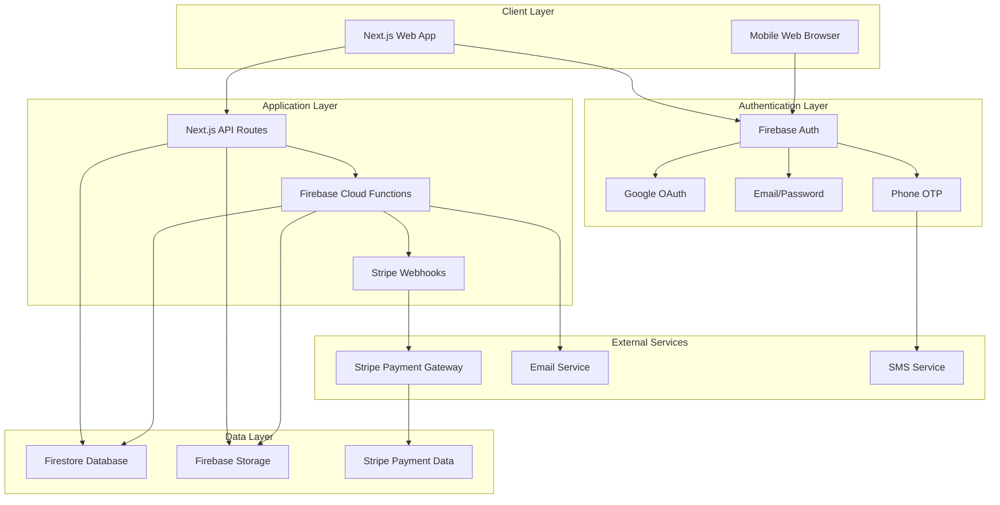

# 3arida Petition Platform - Architecture Document

## System Architecture Overview

The 3arida platform follows a modern serverless architecture built on Firebase services with Next.js frontend, providing scalability, security, and cost-effectiveness for the Morocco market.

## Architecture Diagram



## Technology Stack Details

### Frontend Architecture

- **Framework**: Next.js 14+ with App Router
- **Styling**: TailwindCSS with shadcn/ui components
- **State Management**: React Context + SWR for server state
- **Authentication**: Firebase Auth SDK
- **Payments**: Stripe Elements and Payment Intents
- **Real-time**: Firestore real-time listeners

### Backend Architecture

- **Database**: Firestore (NoSQL document database)
- **Authentication**: Firebase Authentication
- **File Storage**: Firebase Storage with CDN
- **Serverless Functions**: Firebase Cloud Functions
- **Payment Processing**: Stripe API with webhooks
- **Hosting**: Firebase Hosting with global CDN

### Data Architecture

#### Collection Structure

```
firestore/
├── petitions/
│   ├── {petitionId}/
│   │   ├── title, description, media
│   │   ├── category, subcategory
│   │   ├── creatorId, signatures
│   │   └── status, tier, qrCodeUrl
├── users/
│   ├── {userId}/
│   │   ├── name, email, phone
│   │   ├── verifiedEmail, verifiedPhone
│   │   └── role, creatorPageId
├── creatorPages/
│   ├── {pageId}/
│   │   ├── userId, bio, photoUrl
│   │   └── association, contactInfo
├── signatures/
│   ├── {signatureId}/
│   │   ├── petitionId, userId
│   │   └── signedAt, ipAddress
└── moderators/
    ├── {moderatorId}/
    │   ├── userId, assignedBy
    │   └── permissions{}
```

#### Security Rules Architecture

```javascript
// Hierarchical security model
- Public read access for approved petitions
- Creator-only write access for petition management
- Role-based access for moderation features
- Admin-only access for user management
- Signature verification through phone OTP
```

## Component Architecture

### Frontend Components Hierarchy

```
App/
├── Layout/
│   ├── Header (Navigation, Auth)
│   ├── Footer
│   └── Sidebar (Filters)
├── Pages/
│   ├── Home (Petition Discovery)
│   ├── Petition Detail
│   ├── Create Petition
│   ├── Creator Page
│   ├── User Dashboard
│   └── Admin Dashboard
├── Components/
│   ├── PetitionCard
│   ├── SignatureProgress
│   ├── PaymentModal
│   ├── QRCodeModal
│   └── FilterSidebar
└── Services/
    ├── AuthService
    ├── PetitionService
    ├── PaymentService
    └── QRService
```

### Backend Services Architecture

```
✅ Implemented Services/
├── Firebase Configuration/
│   ├── ✅ Client-side Firebase config
│   ├── ✅ Admin SDK configuration
│   └── ✅ Authentication context
├── Data Models/
│   ├── ✅ TypeScript interfaces (15+ models)
│   ├── ✅ Zod validation schemas
│   └── ✅ Service layer architecture
├── Security/
│   ├── ✅ Firestore security rules
│   ├── ✅ Role-based access control
│   └── ✅ Input validation utilities
└── Database/
    ├── ✅ Collection structure design
    ├── ✅ Composite indexes (15+)
    └── ✅ CRUD service layer

🚧 Planned Services/
├── Authentication/
│   ├── onUserCreate (Create user profile)
│   ├── verifyPhone (OTP verification)
│   └── updateUserRole (Admin function)
├── Petitions/
│   ├── createPetition (Validation & creation)
│   ├── signPetition (Signature processing)
│   └── moderatePetition (Admin actions)
├── Payments/
│   ├── createPaymentIntent
│   ├── handleStripeWebhook
│   └── processQRUpgrade
└── Utilities/
    ├── generateQRCode
    ├── sendNotification
    └── calculatePricing
```

## Security Architecture

### Authentication Flow

1. **User Registration**: Email verification required
2. **Petition Creation**: Verified email required
3. **Petition Signing**: Phone OTP verification required
4. **Admin Access**: Role-based permissions check

### Data Security Layers

1. **Client-side Validation**: Form validation and input sanitization
2. **Firebase Security Rules**: Database-level access control
3. **Cloud Function Validation**: Server-side business logic validation
4. **Stripe Security**: PCI-compliant payment processing

### Privacy Protection

- **Data Minimization**: Collect only necessary user information
- **Encryption**: All data encrypted in transit and at rest
- **Access Logging**: Audit trail for admin actions
- **GDPR Compliance**: User data deletion and export capabilities

## Scalability Architecture

### Horizontal Scaling

- **Firestore**: Automatic scaling with regional replication
- **Cloud Functions**: Auto-scaling based on demand
- **Firebase Hosting**: Global CDN with edge caching
- **Stripe**: Enterprise-grade payment processing

### Performance Optimization

- **Database Indexing**: Composite indexes for complex queries
- **Image Optimization**: WebP conversion and responsive images
- **Code Splitting**: Route-based and component-based splitting
- **Caching Strategy**: SWR with stale-while-revalidate pattern

### Monitoring and Observability

- **Firebase Analytics**: User behavior and engagement metrics
- **Performance Monitoring**: Web Vitals and Core Web Vitals
- **Error Tracking**: Real-time error monitoring and alerting
- **Custom Metrics**: Business KPIs and petition analytics

## Deployment Architecture

### Environment Strategy

```
Development → Staging → Production
     ↓           ↓         ↓
Firebase      Firebase   Firebase
Emulator      Project    Project
Suite         (Staging)  (Production)
```

### CI/CD Pipeline

1. **Code Commit**: GitHub repository with branch protection
2. **Automated Testing**: Unit, integration, and E2E tests
3. **Build Process**: Next.js build with optimization
4. **Deployment**: Firebase Hosting with atomic deployments
5. **Monitoring**: Post-deployment health checks

### Backup and Recovery

- **Firestore Backups**: Automated daily backups with point-in-time recovery
- **Code Repository**: Git-based version control with multiple remotes
- **Configuration Management**: Environment variables and secrets management
- **Disaster Recovery**: Multi-region deployment capability

## Integration Architecture

### Third-Party Integrations

- **Stripe**: Payment processing with webhook validation
- **Firebase**: Complete backend-as-a-service integration
- **BoxyHQ Starter**: SaaS foundation with role-based access
- **Email Service**: Transactional emails through Firebase Extensions

### API Design

- **RESTful APIs**: Standard HTTP methods and status codes
- **Real-time APIs**: Firestore listeners for live updates
- **Webhook APIs**: Stripe webhook handling with signature verification
- **GraphQL**: Optional future enhancement for complex queries

This architecture provides a solid foundation for the 3arida platform, ensuring scalability, security, and maintainability while leveraging modern serverless technologies optimized for the Morocco market.
