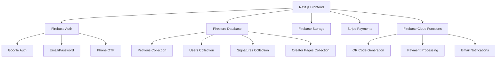

AZ:"

# Design Document

## 📊 Implementation Status

**Last Updated**: January 2025  
**Design Implementation**: 100% Complete ✅  
**All architectural components have been successfully implemented and tested.**

## Overview

The 3arida Petition Platform is built on a modern Next.js 14 foundation, integrating Firebase services for authentication, database, and storage, with Stripe for payment processing. The architecture follows a modern Next.js application pattern with server-side rendering for SEO optimization and real-time data synchronization through Firestore.

## Architecture

### High-Level Architecture



### Technology Stack Integration

- **Frontend**: Next.js with TailwindCSS and shadcn/ui components
- **Authentication**: Firebase Auth replacing Auth.js from starter kit
- **Database**: Firestore with real-time subscriptions
- **Payments**: Stripe integration (existing in starter kit, adapted for MAD)
- **Storage**: Firebase Storage for petition media
- **Hosting**: Firebase Hosting for production deployment

## Components and Interfaces

### Core Components

#### 1. Authentication System

```typescript
interface AuthService {
  signInWithGoogle(): Promise<User>;
  signInWithEmail(email: string, password: string): Promise<User>;
  signInWithPhone(phoneNumber: string): Promise<void>;
  verifyPhoneOTP(code: string): Promise<User>;
  signOut(): Promise<void>;
  getCurrentUser(): User | null;
}
```

#### 2. Petition Management

```typescript
interface PetitionService {
  createPetition(petition: CreatePetitionRequest): Promise<Petition>;
  updatePetition(id: string, updates: Partial<Petition>): Promise<void>;
  deletePetition(id: string): Promise<void>;
  getPetition(id: string): Promise<Petition>;
  listPetitions(filters: PetitionFilters): Promise<Petition[]>;
  signPetition(petitionId: string, userId: string): Promise<void>;
}
```

#### 3. Payment Processing

```typescript
interface PaymentService {
  calculatePetitionPrice(signatureCount: number): number;
  createPaymentIntent(amount: number, petitionId: string): Promise<string>;
  processQRUpgrade(petitionId: string): Promise<string>;
  handleWebhook(event: StripeEvent): Promise<void>;
}
```

#### 4. QR Code Generation

```typescript
interface QRService {
  generateQRCode(petitionUrl: string): Promise<string>;
  downloadQRCode(qrCodeId: string, format: 'PNG' | 'PDF'): Promise<Blob>;
}
```

### UI Components Architecture

#### Page Components

- `HomePage`: Petition discovery with filters
- `PetitionPage`: Individual petition view and signing
- `CreatePetitionPage`: Petition creation flow with pricing
- `CreatorPage`: Creator profile and petition list
- `AdminDashboard`: Moderation and analytics interface
- `UserDashboard`: User's petitions and signatures

#### Shared Components

- `PetitionCard`: Reusable petition display component
- `SignatureProgress`: Visual signature count progress
- `PaymentModal`: Stripe payment integration
- `QRCodeModal`: QR code preview and download
- `FilterSidebar`: Petition filtering interface

## Data Models

### Firestore Collections Schema

#### Petitions Collection

```typescript
interface Petition {
  id: string;
  title: string;
  description: string;
  media?: {
    type: 'image' | 'video';
    url: string;
    thumbnailUrl?: string;
  };
  category: string;
  subcategory: string;
  creatorId: string;
  requiredSignatures: number;
  currentSignatures: number;
  status: 'draft' | 'pending' | 'approved' | 'paused' | 'deleted';
  tier:
    | 'free'
    | 'starter'
    | 'growth'
    | 'impact'
    | 'large'
    | 'mass'
    | 'enterprise';
  qrCodeUrl?: string;
  paymentStatus: 'none' | 'pending' | 'completed';
  createdAt: Timestamp;
  updatedAt: Timestamp;
}
```

#### Users Collection

```typescript
interface User {
  id: string;
  name: string;
  email: string;
  phone?: string;
  verifiedEmail: boolean;
  verifiedPhone: boolean;
  role: 'user' | 'moderator' | 'admin';
  creatorPageId?: string;
  createdAt: Timestamp;
}
```

#### Creator Pages Collection

```typescript
interface CreatorPage {
  id: string;
  userId: string;
  bio?: string;
  photoUrl?: string;
  association?: string;
  contactInfo?: {
    email?: string;
    phone?: string;
    website?: string;
  };
  petitionCount: number;
  totalSignatures: number;
  createdAt: Timestamp;
}
```

#### Signatures Collection

```typescript
interface Signature {
  id: string;
  petitionId: string;
  userId: string;
  signedAt: Timestamp;
  ipAddress?: string;
}
```

#### Moderators Collection

```typescript
interface Moderator {
  id: string;
  userId: string;
  assignedBy: string;
  permissions: {
    approve: boolean;
    pause: boolean;
    delete: boolean;
    statsAccess: boolean;
  };
  createdAt: Timestamp;
}
```

### Firestore Security Rules Design

```javascript
rules_version = '2';
service cloud.firestore {
  match /databases/{database}/documents {
    // Petitions - readable by all, writable by creator or moderators
    match /petitions/{petitionId} {
      allow read: if true;
      allow create: if request.auth != null && request.auth.token.email_verified;
      allow update: if request.auth != null &&
        (resource.data.creatorId == request.auth.uid ||
         isModerator(request.auth.uid));
      allow delete: if request.auth != null &&
        (resource.data.creatorId == request.auth.uid ||
         hasModeratorPermission(request.auth.uid, 'delete'));
    }

    // Users - readable by owner, writable by owner or admin
    match /users/{userId} {
      allow read, write: if request.auth != null &&
        (request.auth.uid == userId || isAdmin(request.auth.uid));
    }

    // Signatures - readable by petition creator, writable by authenticated users
    match /signatures/{signatureId} {
      allow read: if request.auth != null;
      allow create: if request.auth != null &&
        request.auth.token.phone_number != null;
    }
  }
}
```

## Error Handling

### Client-Side Error Handling

- **Authentication Errors**: Display user-friendly messages for login failures
- **Payment Errors**: Show specific Stripe error messages and retry options
- **Network Errors**: Implement retry mechanisms with exponential backoff
- **Validation Errors**: Real-time form validation with clear error messages

### Server-Side Error Handling

- **Firebase Function Errors**: Structured error responses with error codes
- **Database Errors**: Transaction rollbacks and data consistency checks
- **Payment Processing Errors**: Webhook retry logic and failure notifications
- **File Upload Errors**: Size and type validation with progress indicators

### Error Monitoring

- **Sentry Integration**: Real-time error tracking and alerting
- **Firebase Analytics**: User behavior and error pattern analysis
- **Custom Logging**: Structured logging for debugging and monitoring

## Testing Strategy

### Unit Testing

- **Component Testing**: React Testing Library for UI components
- **Service Testing**: Jest for business logic and API services
- **Utility Testing**: Pure function testing for helpers and validators

### Integration Testing

- **Firebase Integration**: Test Firestore operations with emulator
- **Stripe Integration**: Test payment flows with Stripe test mode
- **Authentication Flow**: Test complete auth workflows

### End-to-End Testing

- **Petition Creation Flow**: Complete petition creation and payment
- **Signing Flow**: Phone verification and petition signing
- **Admin Workflows**: Moderation and user management flows

### Performance Testing

- **Load Testing**: Simulate high petition signing volume
- **Database Performance**: Query optimization and indexing
- **Image/Video Upload**: Large file handling and optimization

## Security Considerations

### Authentication Security

- **Multi-Factor Authentication**: Email + Phone verification requirements
- **Session Management**: Firebase Auth token refresh and validation
- **Role-Based Access**: Strict permission checking at all levels

### Data Security

- **Input Validation**: Server-side validation for all user inputs
- **SQL Injection Prevention**: Firestore parameterized queries
- **XSS Prevention**: Content sanitization and CSP headers

### Payment Security

- **PCI Compliance**: Stripe handles sensitive payment data
- **Webhook Verification**: Stripe signature validation
- **Fraud Prevention**: Rate limiting and suspicious activity detection

## Performance Optimization

### Frontend Optimization

- **Code Splitting**: Route-based and component-based splitting
- **Image Optimization**: Next.js Image component with WebP support
- **Caching Strategy**: SWR for data fetching with cache invalidation

### Backend Optimization

- **Database Indexing**: Composite indexes for complex queries
- **Cloud Function Optimization**: Cold start reduction and memory tuning
- **CDN Integration**: Firebase Hosting with global CDN

### Monitoring and Analytics

- **Performance Monitoring**: Web Vitals tracking and optimization
- **User Analytics**: Firebase Analytics for user behavior insights
- **Business Metrics**: Custom dashboards for petition and signature metrics
